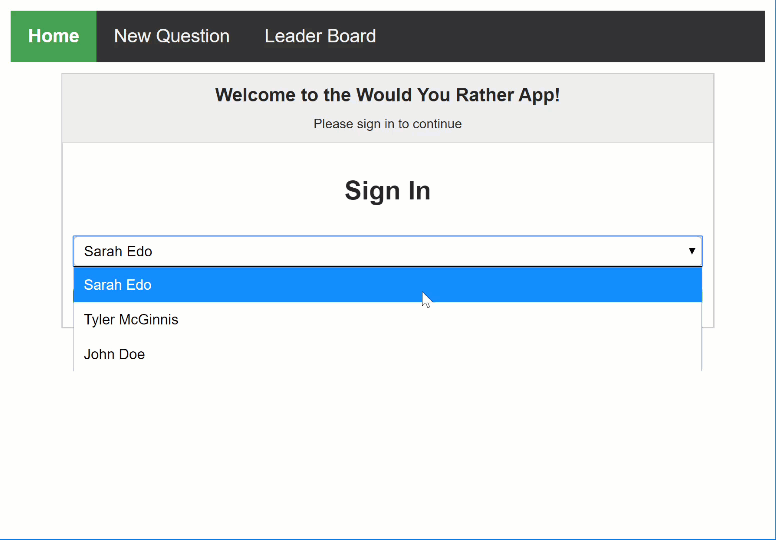
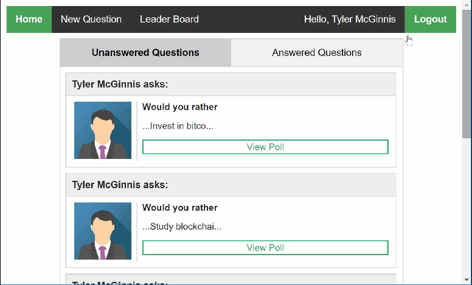
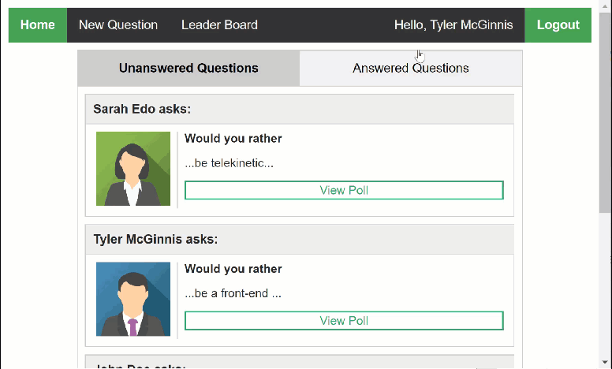
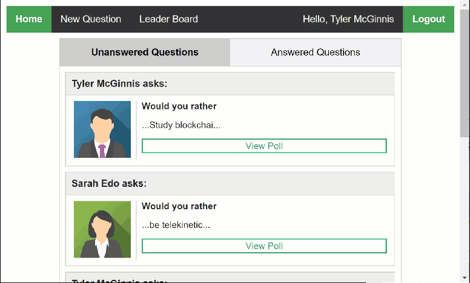
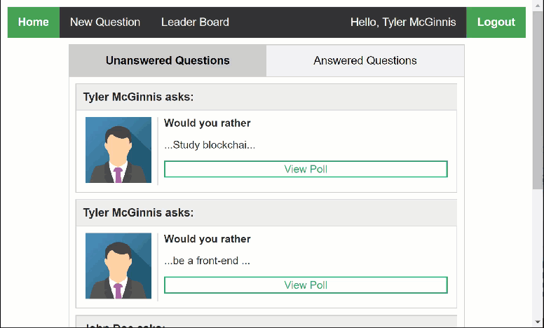

# "Would Your Rather?" Project

This is my completed "Would You Rather?" Project for Udacity's React Fundamentals course. In this project, we build a web app that lets a user play the “Would You Rather?” game. The game goes like this: A user is asked a question in the form: “Would you rather [option A] or [option B] ?”. Answering "neither" or "both" is against the rules.

In the app, users will be able to answer questions, see which questions they haven’t answered, see how other people have voted, post questions, and see the ranking of users on the leaderboard.

## Instructions

To run the project:

* install all project dependencies with `npm install`
* start the development server with `npm start`

## Features

### Login

If you visit any page in the app without being signed in, then you will be asked to sign in first.

<p align="center">
  
</p>

### Homepage

After you sign in, you'll see a dashboard containing a list of questions categorised into two tabs - Unanswered and Answered. Selecting either tab will filter the questions.

<p align="center">
  
</p>

### New Question

If you ask a new question, all users will see the question in their Unanswered Questions list.  

<p align="center">
  
</p>

### Answer Question

If you click on View Poll in an unanswered question, then you will be asked to answer the question. After you answer the question, you'll see the number of votes for each choice.

<p align="center">
  
</p>

### Leaderboard

The leaderboard ranks each user based on how many questions they answered and created. The more questions you answer and create, the higher your score.

<p align="center">
  
</p>

## Project Structure
```bash
├── README.md # This file.
├── package.json # npm package manager file. It's unlikely that you'll need to modify this.
├── public
│   ├── favicon.ico # React Icon, You may change if you wish.
│   ├── images # Images of avatars
│   │   ├── leaf.svg
│   │   ├── snow.svg
│   │   ├── tyler.svg
│   └── index.html # DO NOT MODIFY
└── src
    ├── actions # Redux actions to be dispatched
    │   ├── authedUser.js # Actions for setting the logged-in user
    │   ├── questions.js # Actions for adding and answering questions
    │   ├── users.js # Actions for receiving user data
    │   └── shared.js # Actions that are common across the state tree
    ├── components # React components
    │   ├── App.js # This is the root of the app.
    │   ├── ErrorNotFound.js # This component is displayed when the URL is not valid.
    │   ├── Home.js # Dashboard showing a list of questions categorised into unanswered and answered.
    │   ├── Leaderboard.js # Leaderboard showing the scores of each author based on questions answered and created.
    │   ├── Login.js # Login screen
    │   ├── Nav.js # Navigation menu
    │   ├── NewQuestion.js # Allows user to add a new question.
    │   ├── Progressmeter.js # UI component for rendering a progress meter
    │   ├── Question.js # UI component for rendering a question as part of a collection of questions.
    │   ├── QuestionForm.js # Allows user to answer a question.
    │   ├── QuestionList.js # Renders a list of questions.
    │   ├── QuestionPage.js # Display the Question Form or Question Result depending on whether the question is answered.
    │   ├── QuestionResult.js # Display the voting results of the question.
    │   └── User.js # UI component for showing the user stats in the Leaderboard
    ├── middleware # Redux middleware
    │   ├── logger.js # Logs state changes to the console
    │   └── index.js # Combines middleware
    ├── reducers # Redux reducers for updating the store
    │   ├── authedUser.js # Logged in user
    │   ├── questions.js # Questions
    │   ├── users.js # Users
    │   └── index.js # commbines reducers into a single reducer
    ├── util
    │   ├── _DATA.js # Mock backend server so we can focus on front-end development
    │   └── api.js # API for interacting with backend server
    ├── index.css # Global styles.
    └── index.js # You should not need to modify this file. It is used for DOM rendering only.
```